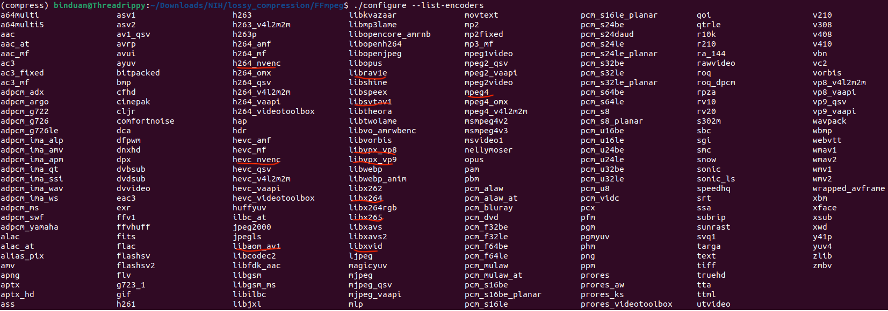

 # To-be-Installed codecs in ffmpeg
 
 
 ## run bash file
 `bash scripts/ffmpeg_hdf5_install.sh`

 ## Quick note
 If installation complete, nvcodec not available. Check the README of installed nv-codec-headers, see if the nvidia-driver version meets the requirement. If not, you may either upgrade/downgrade nvidia-driver or upgrade/downgrade nv-codec-headers and ffmpeg version both.

 The installing script is written in a function manner. Feel free to run them separately if partial libraries needed. If any questions, you can either open an issue or drop me an email. Thanks.

 
 ## Useful links
 1. https://trac.ffmpeg.org/wiki/HWAccelIntro
 2. https://developer.nvidia.com/video-encode-and-decode-gpu-support-matrix-new
 3. https://docs.nvidia.com/video-technologies/video-codec-sdk/ffmpeg-with-nvidia-gpu/
 4. https://trac.ffmpeg.org/wiki/CompilationGuide/Ubuntu
 5. https://askubuntu.com/questions/1189174/how-do-i-use-ffmpeg-and-rav1e-to-create-high-quality-av1-files
 6. https://trac.ffmpeg.org/ticket/7782
 7. https://gist.github.com/Brainiarc7/3f7695ac2a0905b05c5b
 8. https://gist.github.com/kiyoon/55a7bf31f926edec94abebb22dc3eabd
 9. https://github.com/NVIDIA/cuda-samples/issues/46